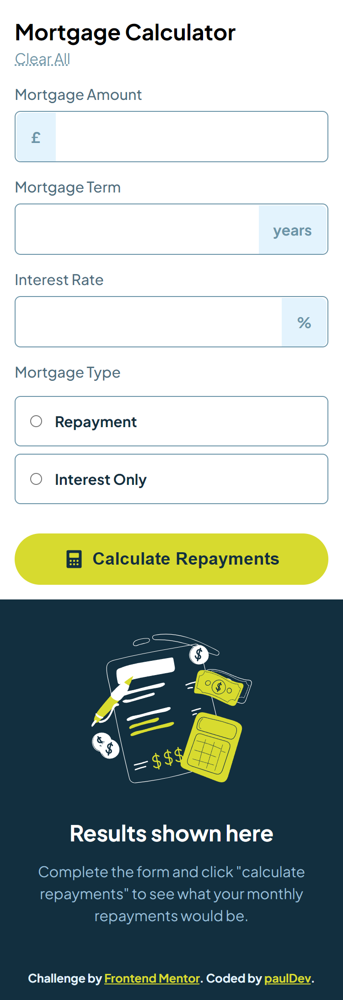

# Frontend Mentor - Mortgage repayment calculator solution

This is a solution to the [Mortgage repayment calculator challenge on Frontend Mentor](https://www.frontendmentor.io/challenges/mortgage-repayment-calculator-Galx1LXK73). Frontend Mentor challenges help you improve your coding skills by building realistic projects.

## Overview

### The challenge

Users should be able to:

- Input mortgage information and see monthly repayment and total repayment amounts after submitting the form
- See form validation messages if any field is incomplete
- Complete the form only using their keyboard
- View the optimal layout for the interface depending on their device's screen size
- See hover and focus states for all interactive elements on the page

### Screenshot

Mobile version

Desktop version

### Links

- Solution URL: [https://www.frontendmentor.io/solutions/frontend-mentor-mortgage-repayment-calculator-beTLdEROl6](https://www.frontendmentor.io/solutions/frontend-mentor-mortgage-repayment-calculator-beTLdEROl6)
- Live Site URL: [https://dev-paull.github.io/mortgage-repayment-calculator/](https://dev-paull.github.io/mortgage-repayment-calculator/)

## My process

- 🔎 Analyzed the screenshots *(design folder)* and the style-guide.
- 📱 Structured the mobile version first
- ⚙️ Coded the calculation logic
- 📖 Read about pseudo elements
- 🖥️ Adapted layout to the desktop version
- 🪳 Fixed bugs and made some adjustments

#### TODO :

- Custom radio button styles
- Improve accessibility
- UI adjustments

### Built with

- Vanilla JS
- Semantic HTML5 markup
- CSS custom properties
- Flexbox
- CSS Grid
- Mobile-first workflow

# Feedback Welcome